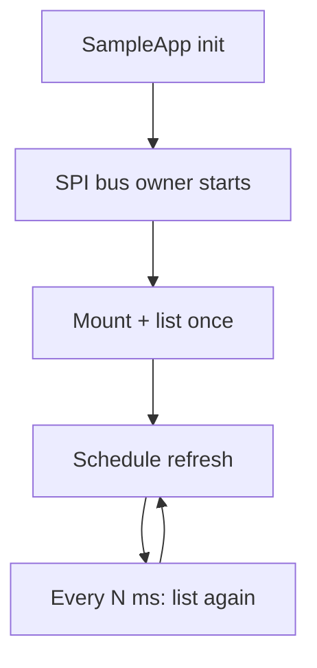

# Hello AtomVM SD Card Example

A tiny Elixir/AtomVM demo for ESP32 that mounts a FAT-formatted SD card over
SPI and lists the directory contents.

Example log output:

```
Starting demo (SD card directory listing)
Mounting SD card (root=/sdcard, driver=sdspi, cs=43)
Listing /sdcard
  - FOO.TXT
  - BAR.BIN
Ready

(then periodically re-prints mount + listing)
```

---

## Quickstart

```sh
# Clone this example AtomVM project
git clone https://github.com/piyopiyoex/hello_atomvm_sd_card.git

# Enter the project directory
cd hello_atomvm_sd_card

# Fetch Elixir dependencies
mix deps.get

# Configure wiring (ESP32-S3 GPIO numbers)
$EDITOR config/config.exs

# Flash the AtomVM runtime to your ESP32 (one-time setup)
mix atomvm.esp32.install

# Build and flash the application firmware to the device
mix do clean + atomvm.esp32.flash --port /dev/ttyACM0

# Open a serial monitor to view runtime logs
picocom /dev/ttyACM0
```

---

## Architecture

This app shares a single physical SPI bus and runs SD mount + directory listing
inside one serialized SPI transaction.

After the first run, it periodically re-prints the key logs (mount status +
directory listing) so you can still see useful output when you attach a serial
monitor late.



---

## Hardware overview

This project works with standard SD-over-SPI wiring, and also supports the
custom “Piyopiyo PCB” used in other examples.

Hardware materials for the Piyopiyo PCB live here:

- [https://github.com/piyopiyoex/piyopiyo-pcb](https://github.com/piyopiyoex/piyopiyo-pcb)

Board revisions:

- **v1.5 or lower** — original wiring
- **v1.6 or higher** — same board, except SDCard-CS is on a different GPIO

Pin selection is configured in `config/config.exs`.

<p align="center">
  
</p>

---

## Wiring

Base wiring (XIAO-ESP32S3 / ESP32-S3 GPIO):

| Function  | XIAO-ESP32S3 pin | ESP32-S3 GPIO |
| --------- | ---------------- | ------------- |
| SCLK      | D8               | 7             |
| MISO      | D9               | 8             |
| MOSI      | D10              | 9             |
| SDCard CS | —                | 43            |

Notes:

- The SD card must be FAT-formatted.
- `SDCard CS` depends on your board wiring.
  - Piyopiyo PCB **v1.5 or lower**: SDCard CS = GPIO4
  - Piyopiyo PCB **v1.6 or higher**: SDCard CS = GPIO43
- Configure pins in `config/config.exs`.
